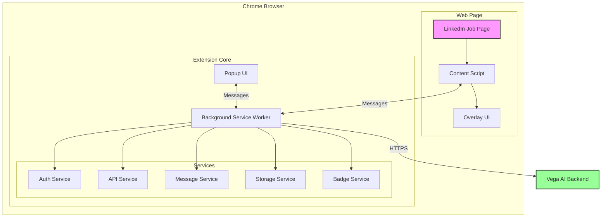
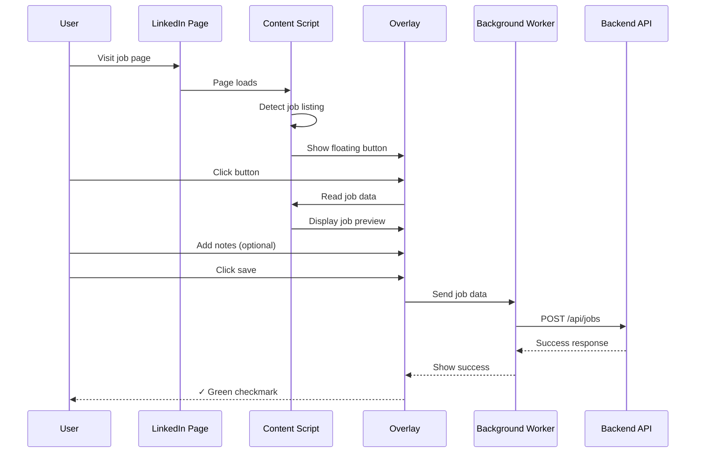
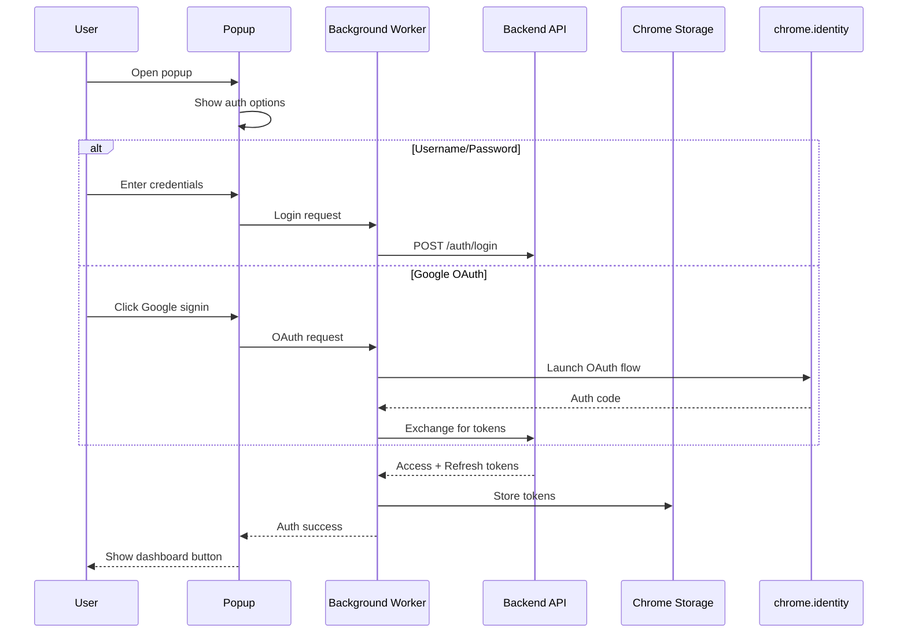

# Technical Design Document

## Vega AI Browser Extension

### Overview

A Chrome extension that allows users to save job listings from LinkedIn to the Vega AI backend. Built with TypeScript and Manifest V3. All actions are user-initiated. The extension never automatically collects data. Supports both cloud and self-hosted backends.

## 🏗️ Architecture

### High-Level Design



### Directory Structure

```plaintext
src/
├── background/          # Service worker and background services
│   ├── services/       # Modular service implementations
│   │   ├── auth/      # Multi-provider authentication
│   │   │   ├── IAuthProvider.ts           # Provider interface
│   │   │   ├── IAuthService.ts            # Service interface
│   │   │   ├── GoogleAuthProvider.ts      # Google OAuth implementation
│   │   │   ├── PasswordAuthService.ts     # Username/password auth
│   │   │   ├── MultiProviderAuthService.ts # Main auth service
│   │   │   └── AuthProviderFactory.ts     # Provider factory
│   │   ├── api/       # Backend API communication
│   │   ├── message/   # Chrome extension messaging
│   │   ├── storage/   # Chrome storage wrapper
│   │   └── badge/     # Extension badge management
│   └── ServiceManager.ts # Coordinates all services
│
├── content/            # Content scripts injected into web pages
│   ├── extractors/    # Job data reading modules
│   │   ├── IJobReader.ts       # Common interface
│   │   └── linkedin.ts         # LinkedIn-specific reader
│   ├── overlay.ts     # Floating UI component
│   └── index.ts       # Content script entry point
│
├── popup/             # Extension popup UI
├── styles/            # Global styles (Tailwind CSS)
├── types/             # TypeScript type definitions
├── config/            # Configuration management
└── utils/             # Shared utilities (logger, etc.)
```

## 🔧 Core Components

### Background Services

#### Authentication Service (`MultiProviderAuthService`)

Handles both username/password and Google OAuth authentication. Automatically refreshes tokens when they expire. Each auth method has its own provider class, making it easy to add new methods.

```typescript
interface IAuthService {
  login(): Promise<void>;
  loginWithProvider(provider: AuthProviderType, credentials?: unknown): Promise<void>;
  logout(): Promise<void>;
  getAuthToken(): Promise<string | null>;
  refreshTokens(): Promise<void>;
  isAuthenticated(): Promise<boolean>;
}
```

#### API Service

Handles all backend communication. If a request gets a 401, it automatically refreshes the auth token and retries. Includes a circuit breaker that temporarily stops requests after multiple failures to prevent hammering a down server.

#### Message Service

Routes messages between the popup, content scripts, and background service worker. All message types are defined in TypeScript for type safety.

#### Storage Service

Wrapper around Chrome's storage API. Makes it easy to save and load data with proper error handling.

#### Badge Service

Shows a little green checkmark or red X on the extension icon to give quick feedback when saving jobs.

### Content Scripts

#### Job Readers

Site-specific modules that implement the `IJobReader` interface:

```typescript
interface IJobReader {
  canRead(url: string): boolean;
  readJobDetails(): JobListing | null;
  isJobPage(url: string): boolean;
  watchForChanges(callback: (job: JobListing | null) => void): void;
}
```

**Current Readers**:

- **LinkedIn**: Reads job data from LinkedIn job view pages when user initiates save
- **Extensible**: Easy to add new job sites

#### Overlay Manager

Creates the floating button and panel that appears on job pages. Positions itself to avoid covering page content. Shows a preview of the job data before saving.

### Popup UI

The main interface users see when they click the extension icon. Handles sign in, backend mode switching (cloud vs local), and connection testing. Built with Tailwind CSS for a clean look.

## 🛠️ Technology Stack

### Core Technologies

- **TypeScript**: Type-safe development with strict compilation
- **Chrome Extension Manifest V3**: Latest extension platform with service workers
- **Webpack 5**: Module bundling with optimization and code splitting
- **Tailwind CSS**: Utility-first styling framework

### Development Tools

- **ESLint**: Code quality and consistency
- **Prettier**: Code formatting
- **Jest**: Testing framework with TypeScript support
- **Husky**: Git hooks for quality gates
- **lint-staged**: Staged file processing

### Build & Deployment

- **GitHub Actions**: CI/CD pipeline
- **Automated releases**: Tag-based release creation
- **Quality gates**: Lint, test, and typecheck on every commit

## 🔒 Security

### Authentication

- Tokens stored in Chrome's encrypted storage
- Auto-refresh when tokens expire
- OAuth follows standard security practices
- Passwords validated before sending

### Data Protection

- Jobs sent directly to backend (not stored locally)
- All API calls use HTTPS
- Input validation prevents malicious data
- Content scripts run in isolated environment
- Token auth prevents CSRF attacks

### Permissions

The extension only asks for what it needs:

- Access to LinkedIn job pages only (`/jobs/*`)
- No access to LinkedIn profiles, messages, or feed
- No browsing history access
- No cookie access
- User must click to save jobs

## 📊 Data Flow

### Job Save Flow



### Authentication Flow



## 🧪 Testing Strategy

### Unit Tests

- **Service classes**: Isolated testing with mocks
- **Readers**: Job data reading validation
- **Utilities**: Helper function testing

### Integration Tests

- **Message passing**: Component communication
- **Auth flows**: End-to-end authentication testing
- **API integration**: Backend communication testing

### Manual Testing

- **Cross-browser**: Chrome and Edge testing
- **Job sites**: Verification on supported platforms
- **User flows**: Complete save workflows

## 🚀 Deployment

### Build Process

1. Run quality checks (lint, test, typecheck)
2. Webpack bundles everything
3. Sync version numbers
4. Optimize CSS and images
5. Include source maps for debugging (dev only)

### Release Pipeline

1. Bump version: `npm version patch`
2. Build the extension: `npm run build`
3. Create ZIP file from `dist/` directory
4. Manually upload to Chrome Web Store
5. Create GitHub release with changelog

### Environment Management

- **Development**: Local development with hot reload
- **Staging**: Manual build triggers for testing
- **Production**: Tag-based releases for users

## 🔄 Configuration

### Config Structure

```typescript
interface ExtensionConfig {
  features: {
    enableGoogleAuth: boolean;    // Off by default
    enableAnalytics: boolean;     // Future feature
    debugMode: boolean;           // Extra logging
  };
  backend: {
    mode: 'cloud' | 'local';
    apiHost: string;
    apiProtocol: 'http' | 'https';
  };
  limits: {
    maxRetries: number;           // 3 by default
    requestTimeout: number;       // 30 seconds
    cacheExpiry: number;         // 5 minutes
  };
}
```

### Settings Service

Settings are saved to Chrome sync storage so they follow users across devices. Users can switch between cloud and local mode in the popup, and test their connection before saving.
