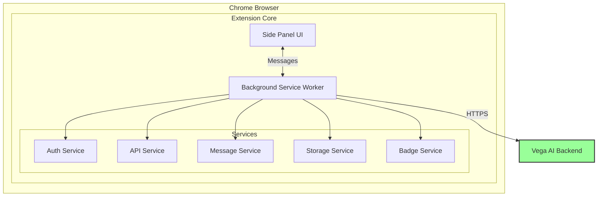
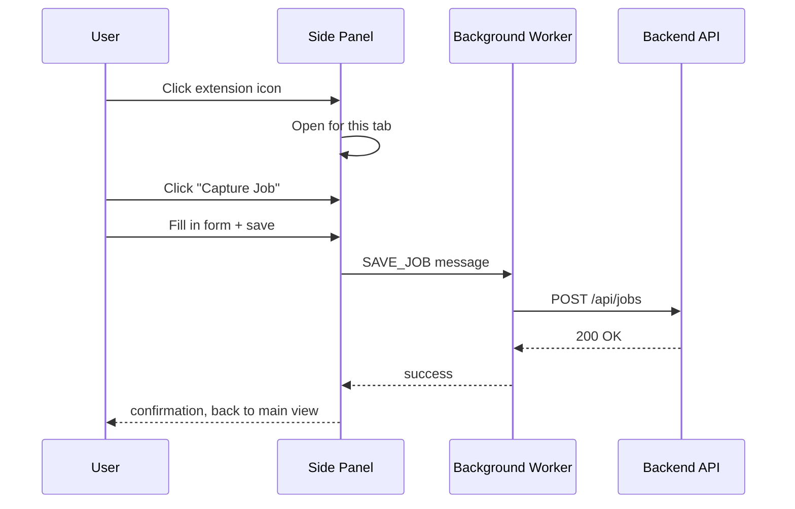
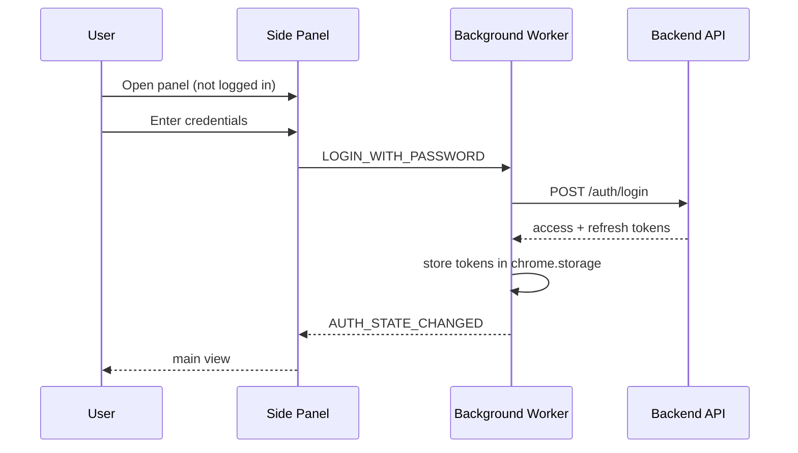

# Technical Design: Vega AI Browser Extension

A Chrome MV3 extension for capturing job listings to the Vega AI backend. No content scripts, no automatic page reading. The user opens the panel, fills in a form, and saves.

## Architecture


```mermaid
graph TB
    subgraph "Chrome Browser"
        subgraph "Extension Core"
            SP[Side Panel UI]
            BG[Background Service Worker]

            subgraph "Services"
                AUTH[Auth Service]
                API[API Service]
                MSG[Message Service]
                STOR[Storage Service]
                BADGE[Badge Service]
            end

            BG --> AUTH
            BG --> API
            BG --> MSG
            BG --> STOR
            BG --> BADGE
        end

        SP <-->|Messages| BG
    end

    BG -->|HTTPS| BACKEND[Vega AI Backend]

    style BACKEND fill:#9f9,stroke:#333,stroke-width:2px
```

```plaintext
src/
├── background/
│   ├── services/
│   │   ├── auth/
│   │   │   ├── IAuthService.ts
│   │   │   ├── MultiProviderAuthService.ts
│   │   │   └── PasswordAuthService.ts
│   │   ├── api/
│   │   ├── message/
│   │   ├── storage/
│   │   └── badge/
│   └── ServiceManager.ts
├── popup/
│   ├── index.html
│   └── index.ts
├── styles/
├── types/
├── config/
└── utils/
```

## Side Panel

The panel opens for a specific tab via `chrome.action.onClicked` -> `chrome.sidePanel.open({ tabId })`. It is tab-specific: hidden when you switch away, visible again when you come back. This avoids tracking state across all open tabs.

Three views: main (capture button and dashboard link), capture (the job form), settings (backend mode and connection test).

The panel re-renders when the owning tab navigates to a new URL, but only if the `JOB_URL_PATTERNS` match result changes. Navigating between two non-job pages triggers no re-render.

```typescript
chrome.tabs.onUpdated.addListener((tabId, changeInfo) => {
  if (changeInfo.url === undefined || !shouldRerender()) return;
  chrome.tabs.query({ active: true, lastFocusedWindow: true }, ([activeTab]) => {
    if (activeTab?.id !== tabId) return;
    const isJobPage = this.isKnownJobPage(changeInfo.url!);
    if (isJobPage !== this.lastKnownJobPageState) this.initialize();
  });
});
```

`JOB_URL_PATTERNS` controls the "Job page detected" UI hint only. It does not gate the capture form, which works on any site.

## Background Services

**Auth (`PasswordAuthService`)**: username/password login, token storage, auto-refresh 1 minute before expiry. Tokens go in Chrome's encrypted local storage.

```typescript
interface IAuthService {
  login(email: string, password: string): Promise<void>;
  logout(): Promise<void>;
  getAuthToken(): Promise<string | null>;
  refreshTokens(): Promise<void>;
  isAuthenticated(): Promise<boolean>;
}
```

**API**: all backend requests, with retry, exponential backoff, and a circuit breaker that trips after 5 consecutive failures and resets after 60 seconds.

**Message**: typed message routing between the panel and service worker.

**Storage**: thin wrapper around `chrome.storage` with error handling.

**Badge**: green/red icon feedback after save operations.

## Data Flow

### Save


```mermaid
sequenceDiagram
    participant U as User
    participant SP as Side Panel
    participant BG as Background Worker
    participant API as Backend API

    U->>SP: Click extension icon
    SP->>SP: Open for this tab
    U->>SP: Click "Capture Job"
    U->>SP: Fill in form + save
    SP->>BG: SAVE_JOB message
    BG->>API: POST /api/jobs
    API-->>BG: 200 OK
    BG-->>SP: success
    SP-->>U: confirmation, back to main view
```

### Auth


```mermaid
sequenceDiagram
    participant U as User
    participant SP as Side Panel
    participant BG as Background Worker
    participant API as Backend API

    U->>SP: Open panel (not logged in)
    U->>SP: Enter credentials
    SP->>BG: LOGIN_WITH_PASSWORD
    BG->>API: POST /auth/login
    API-->>BG: access + refresh tokens
    BG->>BG: store tokens in chrome.storage
    BG-->>SP: AUTH_STATE_CHANGED
    SP-->>U: main view
```

## Permissions

| Permission | Why |
| --- | --- |
| `storage` | tokens and settings |
| `alarms` | background token refresh scheduling |
| `sidePanel` | open the side panel |
| `activeTab` | temporary access to current tab when user interacts with extension |

No `host_permissions` are required. The extension uses a **Privacy-First** architecture: it is blind to browsing history and only receives access to the URL of the tab where the user explicitly opens the extension.

This approach avoids broad "Read your browsing history" warnings and maintains user trust.

API calls go through the backend's CORS config. In development, webpack injects `http://localhost:*/*` into `host_permissions` so local backends work without CORS configuration.

## Stack

TypeScript, Chrome MV3, Webpack 5, Tailwind CSS, Jest, ESLint/Prettier, Husky.

## Deployment

Tag a release with `npm run release:patch|minor|major`, push the tag, CI builds and publishes the ZIP. Webpack syncs the version from `package.json` into the built manifest. Source maps are included in dev builds only.
